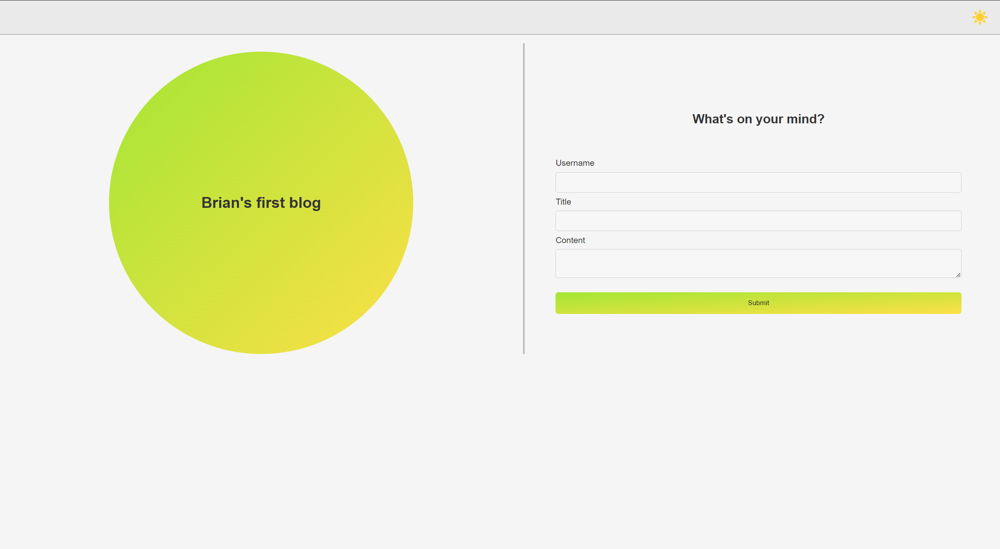
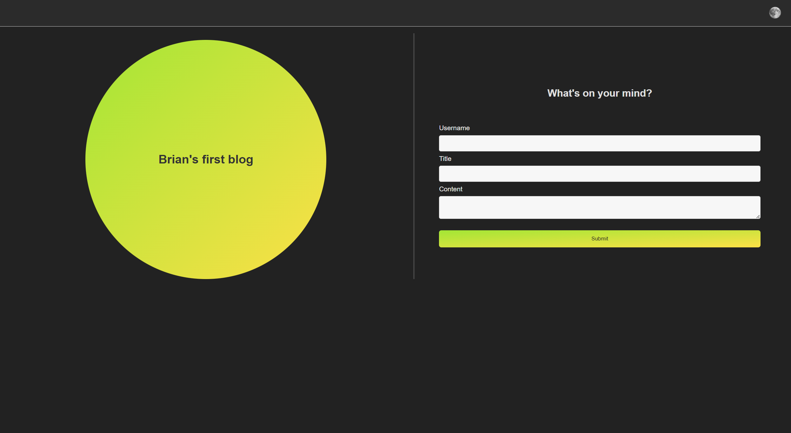

# Brian's First Blog

## Description
Brian's First Blog is a web application that allows users to create and publish blog posts. The app features a user-friendly interface that supports both light and dark themes, providing a comfortable reading experience. Users can input their username, title, and content, and the blog posts are saved in the browser's local storage for easy access and display.

## Features
- Create new blog posts by entering a username, title, and content.
- Display all blog posts dynamically with a clean and organized layout.
- Toggle between light and dark mode.
- Links on the footer to my personal portfolio, blog and email.

## Technologies Used
- **JavaScript**: Used to handle form submissions, manipulate the DOM, and manage local storage for blog data.
- **HTML**: Provides the structure and layout for the web pages.
- **CSS**: Basic styling for a visually appealing interface, including support for light and dark themes.
- **LocalStorage**: Utilized to store blog posts persistently in the browser.

## Screenshot

**Repo:**

[Github Repo](https://github.com/briansotolago/Challenge-4)

**Link of the web Page:**

[Github Page](https://briansotolago.github.io/Challenge-4/)
